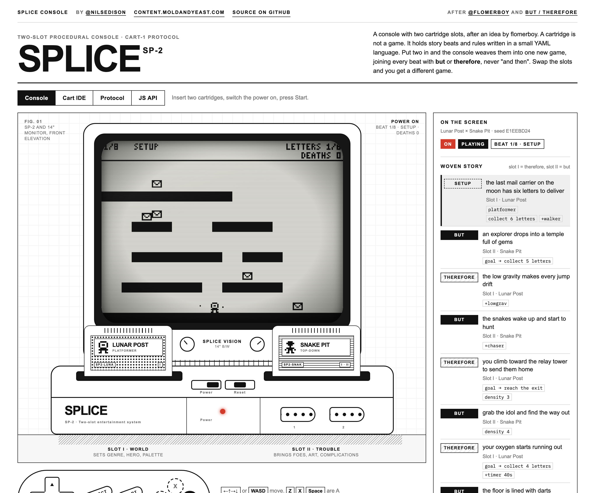

# Splice Console

A console with two cartridge slots. A cartridge is not a game: it holds a few story beats and the rules each beat changes, written in a small YAML language. Put two in and the console weaves them into one new game, joining every beat with **but** or **therefore**, never "and then". Swap the slots and you get a different game. By RM.

**Play it: https://splice.moldandyeast.com**

[](https://splice.moldandyeast.com)

## Download

The whole thing is one HTML file, about 200 KB, with nothing to install and nothing to build.

- Grab [`public/index.html`](public/index.html) from this repo (the **Download raw file** button, top right of the file view), or
- save the live page: `curl -o splice.html https://splice.moldandyeast.com/`

Open it in a browser. It makes no network requests, so it runs from disk and offline.

## Shoutouts

- **[@flomerboy](https://x.com/Flomerboy/status/2106626224286052560)** for the idea: a console with two slots, where the game is whatever the two cartridges make together.
- **[Trey Parker and Matt Stone at NYU](https://www.youtube.com/watch?v=vGUNqq3jVLg&t=3s)** for the rule the weaver enforces. If the beats of your story are joined by "and then", it is boring. Join them with "but" or "therefore" and the story drives itself.

More at https://content.moldandyeast.com · follow [@nilsedison](https://twitter.com/nilsedison) on Twitter · [source on GitHub](https://github.com/moldandyeast/splicedemo).

## How it works

Slot I is the **world**: it sets the genre, the hero and the palette, and supplies the spine of the story. Slot II is the **trouble**: it brings the foes, the art treatment and the complications. The console interleaves their beats, re-labels the connectors so they strictly alternate (setup, but, therefore, but…), and solves a level for each beat from whatever rules are in force by then.

```yaml
cart: 1
id: lunar-post
title: Lunar Post
role: spine
style: { art: outline, palette: paper }
world: { verb: platform, hero: astronaut }
cast:  { item: letter, foe: blob }
beats:
  - setup: the last mail carrier on the moon has six letters to deliver
    set: { goal: collect, count: 6, hazards: [walker] }
  - but: the low gravity makes every jump drift
    add: { twists: [lowgrav] }
  - therefore: you climb toward the relay tower to send them home
    set: { goal: reach }
    add: { density: 1 }
```

- **Deterministic.** The seed is FNV-1a of the two cart ids in slot order. The same pair always makes the same game, and a retry rebuilds the identical level.
- **Any cart works with any other.** Every key belongs to a channel with one owner (slot I owns the verb and the hero, slot II owns the art and the foe), so two carts never conflict.
- **"And then" is a parse error.** `and` and `then` are not connectors. A beat that changes no rule is flagged too, because nothing in play changes.
- **Four verbs**: platformer, top-down, shooter, runner. One bit per pixel on a 192 × 144 screen, four art treatments, three palettes.

Eight cartridges ship on the shelf: Lunar Post, Snake Pit, Star Siege, Night Shift, Glass Tower, Frog Market, Robot Rodeo and Blackout. That is 64 ordered pairs before you write your own.

## The four tabs

| Tab | What it is |
| --- | --- |
| **Console** | The hardware. Click a cart to insert it, drag it onto a slot, click it in the console to eject. Power, Reset, a controller, the woven story beside the screen and the splice trace under it. |
| **Cart IDE** | Write a cartridge. It validates and re-weaves against a partner cart as you type, then burns to the shelf. Your carts are kept in this browser's `localStorage`. |
| **Protocol** | The CART-1 spec: schema, beat operations, the weave algorithm, the merge policy and the live vocabulary. |
| **JS API** | Everything runs on one global, `window.Splice`. Open the browser console on the page and try it. |

```js
const plan = Splice.weave('lunar-post', 'snake-pit')
plan.title                      // "Lunar Post × Snake Pit"
plan.beats[1]                   // { conn: 'BUT', text: 'an explorer drops into…', src: 'II', … }

Splice.console.insert(0, 'star-siege')
Splice.console.insert(1, 'blackout')
Splice.console.reset()

Splice.register.twist('ice', { label: 'Ice', desc: 'Floors are slippery.', tick(L) { /* … */ } })
```

Verbs, hazards, twists, art treatments, palettes and sprites are all registered modules. Anything you register becomes valid CART-1 at once.

## Controls

← ↑ → ↓ or W A S D move · Z, X or Space are A and B (jump or fire) · Enter is Start, and pauses · Shift is Select, which skips to the next beat. The on-screen controller works with touch.

## Structure

- `public/index.html` — the whole piece: markup, styles, the engine and the eight carts. No build step, no third-party requests.
- `fonts/` — IBM Plex Mono's licence (SIL OFL 1.1) and `subset.sh`, which rebuilds the two subset woff2 files inlined in the page as base64. The rest of the page is set in the system's Arial / Helvetica.
- `vendor/` — [js-yaml](https://github.com/nodeca/js-yaml) 4.1.0 and its MIT licence. The page carries the same bytes inline instead of loading them from a CDN.
- `docs/` — the screenshot above.
- `wrangler.jsonc` — Cloudflare Worker serving `public/` as static assets on the custom domain. No server code.

## Run locally

Open `public/index.html`, or:

```sh
npm install
npm run dev
```

## Deploy

Deploys are manual, there is no CI. Uses your existing `wrangler login` session.

```sh
npm run deploy
```
